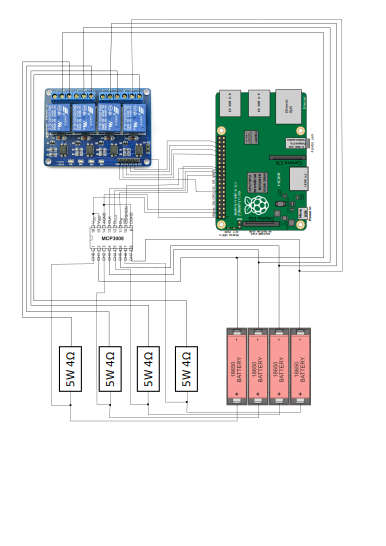
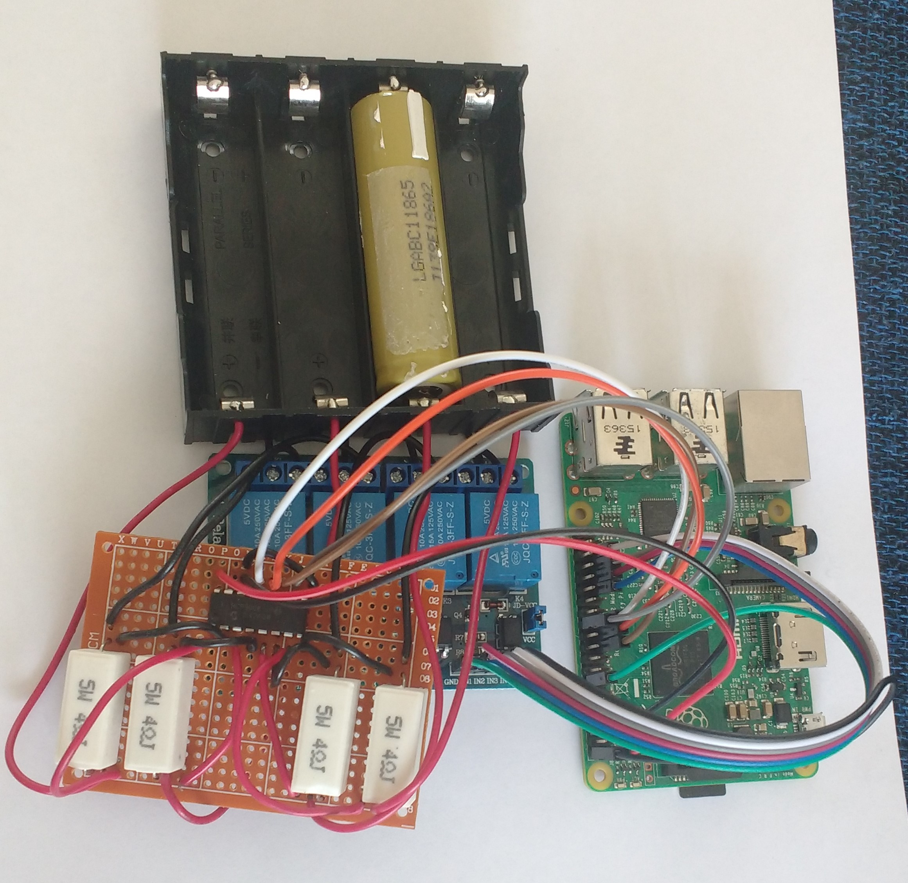
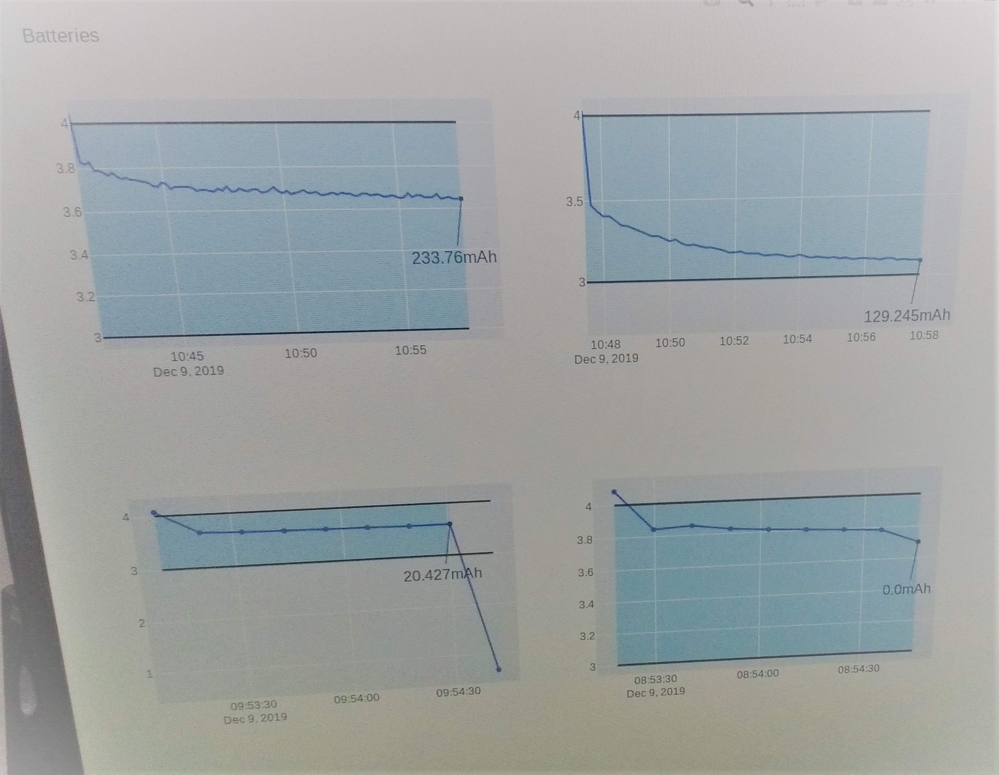
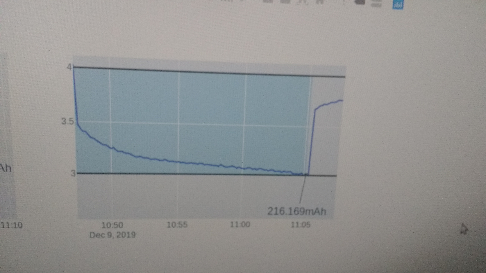

# Raspberry -based, 4-slots 18650 battery tester

This is an open source lithium-ion 18650 cells tester that discharges 4 batteries into 4 resistors, records the current flowing each second, and deduces the total capacity of the cell.

Just put the charged cell in a slot, and the test starts automatically if the cell is charged. You can then follow the test on curves updated automatically in a web page.

At the end of the test, a csv file is created with the recorded voltages and capacity.

When one cell is tested, you can replace it independently of the others.

The advantages of this projects versus a commercial tester like the iMax B6 are:
- all slots are totally independent
- you can see the precise behaviour of the cell
- you can easily create statistics on the tested cells from the saved csv files
- you can expend it to manage more cells

# Construction

## List of material

- 1x raspberry pi
- 1x 4-channel 5V relay
- 4x 4Ohm 5W resistors
- 1x MCP3008 Analog numeric converter
- 1x 4 slots battery holder
- 1x USB wifi dongle (optional)

## Wiring



Example of construction



Test curves



# Set up your Raspberry

## Configure I2C

### Install the required libraries

```
sudo pip3 install --upgrade setuptools
sudo apt-get install -y python-smbus
sudo apt-get install -y i2c-tools
```

### Enable I2C

```
sudo raspi-config
```
In the menus, go to `Interfacing options`, then `I2C` and choose `YES`

Then, run

```
sudo reboot
sudo i2cdetect -y 1
```

## Configure SPI

Configure SPI with the following commands:

```
sudo raspi-config
Interfacing options / SPI / YES
sudo reboot
ls -l /dev/spidev*
```

## Install additional libraries
```
pip3 install -f requirements.txt
```

# Run the program

## Start the script that manages the testing of the batteries
```
python3 tester.py
```

## Start the Flask API
```
python3 app.py
```

# Use it

- First, charge your cells, for example with TP4056 cards.
- Start the raspberry and run the program
- Put the cells in the slots
- Check the curves at http://(raspberryip):8080 or http://localhost:8080 if you work directly on your raspberry
- When a cell is tested, the curve is going out of the blue area
- Replace it with a new cell (wait for 10s before putting the new one)


